Example Data: Housing prices:
=============================

    housing <- read.csv("~/Desktop/eeb-177/lab-work/exercise-8/Rgraphics/dataSets/landdata-states.csv")
    head(housing[1:5])

    ##   State region    Date Home.Value Structure.Cost
    ## 1    AK   West 2010.25     224952         160599
    ## 2    AK   West 2010.50     225511         160252
    ## 3    AK   West 2009.75     225820         163791
    ## 4    AK   West 2010.00     224994         161787
    ## 5    AK   West 2008.00     234590         155400
    ## 6    AK   West 2008.25     233714         157458

ggplot2 VS Base for simple graphs
=================================

    hist(housing$Home.Value)

\# ggplot2 histogram example:

    library(ggplot2)
    ggplot(housing, aes(x = Home.Value)) +
      geom_histogram()

    ## `stat_bin()` using `bins = 30`. Pick better value with `binwidth`.

ggplot2 Base graphics VS ggplot for more complex graphs:
========================================================

    plot(Home.Value ~ Date,
         data=subset(housing, State == "MA"))
    points(Home.Value ~ Date, col="red",
           data=subset(housing, State == "TX"))
    legend(1975, 400000,
           c("MA", "TX"), title="State",
           col=c("black", "red"),
           pch=c(1, 1))

ggplot2 colored scatter plot example:
=====================================

    ggplot(subset(housing, State %in% c("MA", "TX")),
           aes(x=Date,
               y=Home.Value,
               color=State))+
      geom_point()

Geometic Objects (geom)
=======================

    help.search("geom_", package = "ggplot2")

Points (Scatterplot):
=====================

    hp2001Q1 <- subset(housing, Date == 2001.25) 
    ggplot(hp2001Q1,
           aes(y = Structure.Cost, x = Land.Value)) +
      geom_point()

    ggplot(hp2001Q1,
           aes(y = Structure.Cost, x = log(Land.Value))) +
      geom_point()

Lines (Prediction Line):
========================

    hp2001Q1$pred.SC <- predict(lm(Structure.Cost ~ log(Land.Value), data = hp2001Q1))

    p1 <- ggplot(hp2001Q1, aes(x = log(Land.Value), y = Structure.Cost))

    p1 + geom_point(aes(color = Home.Value)) +
      geom_line(aes(y = pred.SC))

Smoothers
=========

    p1 +
      geom_point(aes(color = Home.Value)) +
      geom_smooth()

    ## `geom_smooth()` using method = 'loess'

Text (Label Points):
====================

    p1 + 
      geom_text(aes(label=State), size = 3)

    library("ggrepel")
    p1 + 
      geom_point() + 
      geom_text_repel(aes(label=State), size = 3)

Aesthetic Mapping VS Assignment:
================================

     p1 +
        geom_point(aes(size = 2),
                   color="red") 

Mapping Variables To Other Aesthetics
=====================================

    p1 +
      geom_point(aes(color=Home.Value, shape = region))

    ## Warning: Removed 1 rows containing missing values (geom_point).

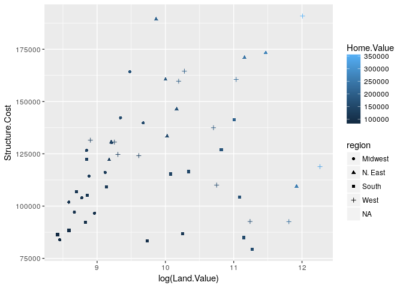

Exercise I:
===========

    library(ggplot2)

    dat <- read.csv("~/Desktop/eeb-177/lab-work/exercise-8/Rgraphics/dataSets/EconomistData.csv")
    head(dat)

    ##   X     Country HDI.Rank   HDI CPI            Region
    ## 1 1 Afghanistan      172 0.398 1.5      Asia Pacific
    ## 2 2     Albania       70 0.739 3.1 East EU Cemt Asia
    ## 3 3     Algeria       96 0.698 2.9              MENA
    ## 4 4      Angola      148 0.486 2.0               SSA
    ## 5 5   Argentina       45 0.797 3.0          Americas
    ## 6 6     Armenia       86 0.716 2.6 East EU Cemt Asia

    ggplot(dat, aes(x = CPI, y = HDI, size = HDI.Rank)) + geom_point()

\# 1. Create a scatter plot with CPI on the x axis and HDI on the y
axis. \# 2. Color the points blue. \# 3. Map the color of the the points
to Region. \# 4. Make the points bigger by setting size to 2 \# 5. Map
the size of the points to HDI.Rank

    library(ggplot2)

    ggplot(dat, aes(x = CPI, y = HDI)) + geom_point(color="blue")

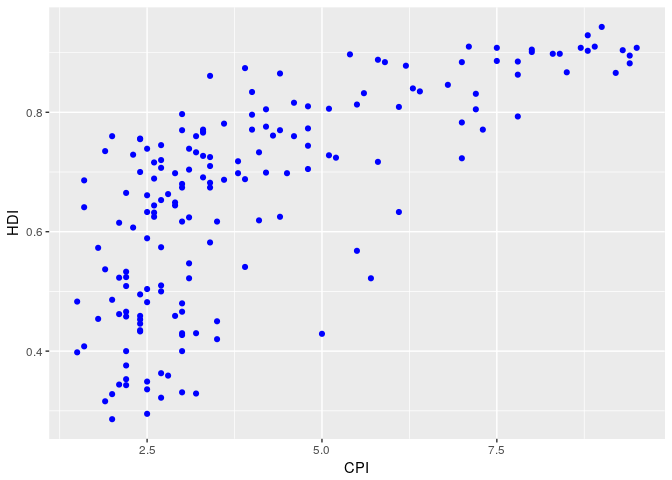

    ggplot(dat, aes(x = CPI, y = HDI, color = Region)) + geom_point()

    ggplot(dat, aes(x = CPI, y = HDI, color = Region)) + geom_point(size=2)

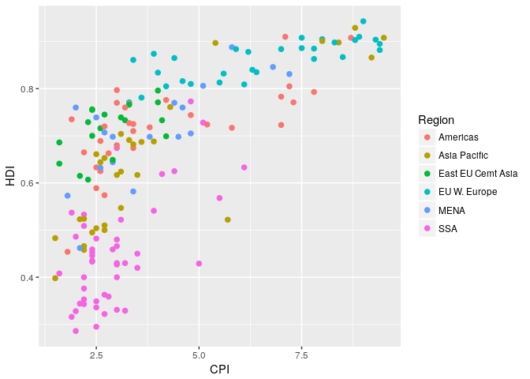

    ggplot(dat, aes(x = CPI, y = HDI)) + geom_point(aes(color = Region, size =  HDI.Rank))

Statistical Transformations:
============================

     args(geom_histogram)

    ## function (mapping = NULL, data = NULL, stat = "bin", position = "stack", 
    ##     ..., binwidth = NULL, bins = NULL, na.rm = FALSE, show.legend = NA, 
    ##     inherit.aes = TRUE) 
    ## NULL

      args(stat_bin)

    ## function (mapping = NULL, data = NULL, geom = "bar", position = "stack", 
    ##     ..., binwidth = NULL, bins = NULL, center = NULL, boundary = NULL, 
    ##     breaks = NULL, closed = c("right", "left"), pad = FALSE, 
    ##     na.rm = FALSE, show.legend = NA, inherit.aes = TRUE) 
    ## NULL

Setting Statistical Transformation Arguments:
=============================================

    housing <- read.csv("~/Desktop/eeb-177/lab-work/exercise-8/Rgraphics/dataSets/landdata-states.csv")

    p2 <- ggplot(housing, aes(x = Home.Value))
    p2 + geom_histogram()

    ## `stat_bin()` using `bins = 30`. Pick better value with `binwidth`.

      p2 + geom_histogram(stat = "bin", binwidth=4000)

Changing The Statistical Transformation:
========================================

    housing.sum <- aggregate(housing["Home.Value"], housing["State"], FUN=mean)
    rbind(head(housing.sum), tail(housing.sum))

    ##    State Home.Value
    ## 1     AK  147385.14
    ## 2     AL   92545.22
    ## 3     AR   82076.84
    ## 4     AZ  140755.59
    ## 5     CA  282808.08
    ## 6     CO  158175.99
    ## 46    VA  155391.44
    ## 47    VT  132394.60
    ## 48    WA  178522.58
    ## 49    WI  108359.45
    ## 50    WV   77161.71
    ## 51    WY  122897.25

    ggplot(housing.sum, aes(x=State, y=Home.Value)) + 
      geom_bar(stat="identity")

Exercise II:
============

1. Re-create a scatter plot with CPI on the x axis and HDI on the y axis (as you did in the previous exercise).
===============================================================================================================

2. Overlay a smoothing line on top of the scatter plot using geom\_smooth, but use a linear model for the predictions. Hint: see ?stat\_smooth.
===============================================================================================================================================

3. Overlay a smoothing line on top of the scatter plot using geom\_line. Hint: change the statistical transformation.
=====================================================================================================================

4. BONUS: Overlay a smoothing line on top of the scatter plot using the default loess method, but make it less smooth. Hint: see ?loess.
========================================================================================================================================

     ggplot(dat, aes(x = CPI, y = HDI)) +
        geom_point()

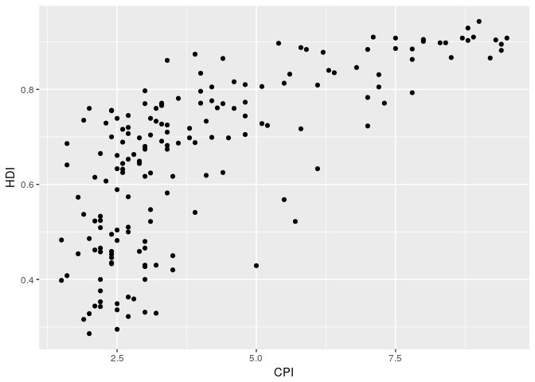

     ggplot(dat, aes(x = CPI, y = HDI)) +
        geom_point() +
        geom_smooth(method = "lm")

     ggplot(dat, aes(x = CPI, y = HDI)) +
        geom_point() +
        geom_smooth()

    ## `geom_smooth()` using method = 'loess'

     ggplot(dat, aes(x = CPI, y = HDI)) +
        geom_point() +
        geom_smooth(span = .4)

    ## `geom_smooth()` using method = 'loess'

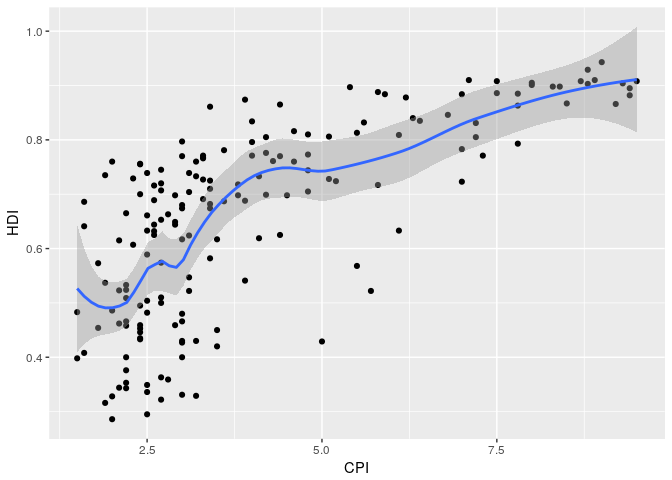

Scale Modification Examples:
============================

     p3 <- ggplot(housing, aes(x = State, y = Home.Price.Index)) + theme(legend.position="top", axis.text=element_text(size = 6))
    (p4 <- p3 + geom_point(aes(color = Date),
                           alpha = 0.5,
                           size = 1.5,
                           position = position_jitter(width = 0.25, height = 0)))

Scale Modification Examples:
============================

     p3 <- ggplot(housing,
                   aes(x = State,
                       y = Home.Price.Index)) + 
              theme(legend.position="top",
                    axis.text=element_text(size = 6))
      (p4 <- p3 + geom_point(aes(color = Date),
                             alpha = 0.5,
                             size = 1.5,
                             position = position_jitter(width = 0.25, height = 0)))

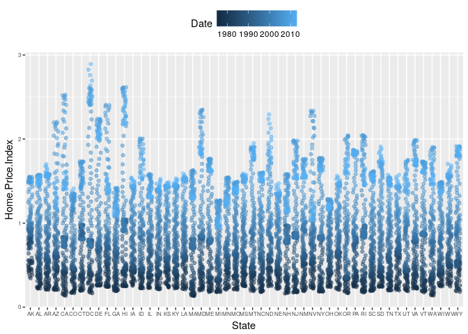

    p4 + scale_x_discrete(name="State Abbreviation") +
        scale_color_continuous(name="",
                               breaks = c(19751, 19941, 20131),
                               labels = c(1971, 1994, 2013))

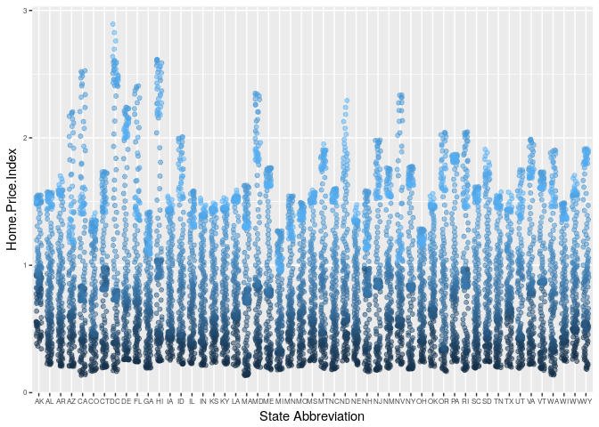

      p4 +
        scale_x_discrete(name="State Abbreviation") +
        scale_color_continuous(name="",
                               breaks = c(19751, 19941, 20131),
                               labels = c(1971, 1994, 2013),
                               low = "blue", high = "red")

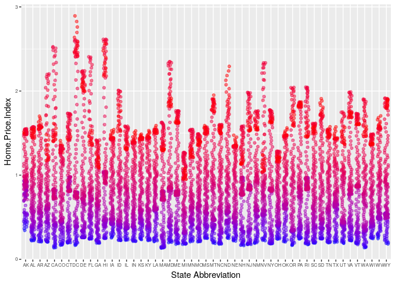

    p4 + scale_x_discrete(name="State Abbreviation") +  scale_color_continuous(name="", breaks = c(1976, 1994, 2013), labels = c("'76", "'94", "'13"))

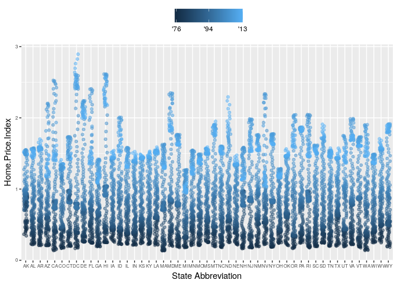

Using different color scales:
=============================

    p4 + scale_x_discrete(name="State Abbreviation") + scale_color_continuous(name="", breaks = c(1976, 1994, 2013), labels = c("'76", "'94", "'13"), low = "blue", high = "red")

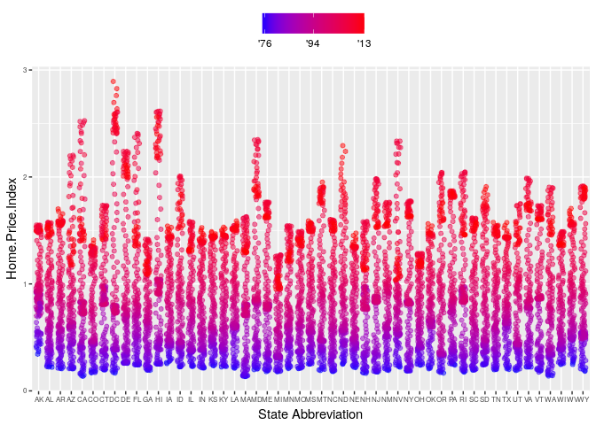

Exercise III:
=============

1: Create a scatter plot with CPI on the x axis and HDI on the y axis. Color the points to indicate region.
===========================================================================================================

2: Modify the x, y, and color scales so that they have more easily-understood names (e.g., spell out “Human development Index” instead of “HDI”).
=================================================================================================================================================

3: Modify the color scale to use specific values of your choosing. Hint: see ?scale\_color\_manual.
===================================================================================================

      ggplot(dat, aes(x = CPI, y = HDI, color = "Region")) +
        geom_point()

    ggplot(dat, aes(x = CPI, y = HDI, color = "Region")) +
      geom_point() +
      scale_x_continuous(name = "Corruption Perception Index") +
      scale_y_continuous(name = "Human Development Index") +
      scale_color_discrete(name = "Region of the world")

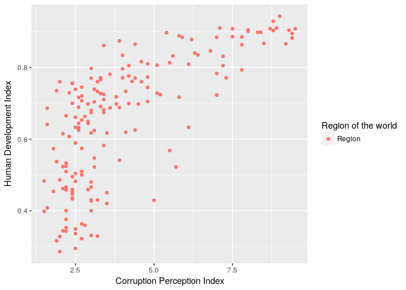

    ggplot(dat, aes(x = CPI, y = HDI, color = "Region")) +
      geom_point() +
      scale_x_continuous(name = "Corruption Perception Index") +
      scale_y_continuous(name = "Human Development Index") +
        scale_color_manual(name = "Region of the world",
                           values = c("#24576D",
                                      "#099DD7",
                                      "#28AADC",
                                      "#248E84",
                                      "#F2583F",
                                      "#96503F"))

Faceting
========

What is the trend in housing prices in each state?
==================================================

      p5 <- ggplot(housing, aes(x = Date, y = Home.Value))
      p5 + geom_line(aes(color = State))  

Faceting to the rescue:
=======================

     (p5 <- p5 + geom_line() +
         facet_wrap(~State, ncol = 10))

Themes:
=======

     p5 + theme_linedraw()

     p5 + theme_light()

Overriding theme defaults:
==========================

      p5 + theme_minimal() +
        theme(text = element_text(color = "turquoise"))

Creating and saving new themes:
===============================

      p5 + theme_minimal() +
        theme(text = element_text(color = "turquoise"))

    theme_new <- theme_bw() +
        theme(plot.background = element_rect(size = 1, color = "blue", fill = "black"),
              text=element_text(size = 12, family = "Serif", color = "ivory"),
              axis.text.y = element_text(colour = "purple"),
              axis.text.x = element_text(colour = "red"),
              panel.background = element_rect(fill = "pink"),
              strip.background = element_rect(fill ="orange"))

      p5 + theme_new

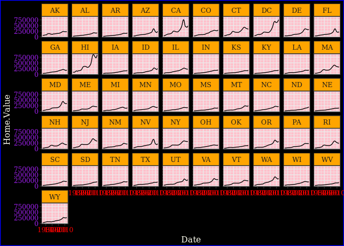

The \#1 FAQ:
============

    housing.byyear <- aggregate(cbind(Home.Value, Land.Value) ~ Date, data = housing, mean)
      ggplot(housing.byyear,
             aes(x=Date)) +
        geom_line(aes(y=Home.Value), color="red") +
        geom_line(aes(y=Land.Value), color="blue")

      library(tidyr)
      home.land.byyear <- gather(housing.byyear,
                                 value = "value",
                                 key = "type",
                                 Home.Value, Land.Value)
      ggplot(home.land.byyear,
             aes(x=Date,
                 y=value,
                 color=type)) +
        geom_line()

Putting It All Together
=======================

Challenge: Recreate This Economist Graph
========================================

     dat <- read.csv("~/Desktop/eeb-177/lab-work/exercise-8/Rgraphics/dataSets/EconomistData.csv")

      pc1 <- ggplot(dat, aes(x = CPI, y = HDI, color = Region))
      pc1 + geom_point()

\# Adding the trend line:

      (pc2 <- pc1 +
         geom_smooth(aes(group = 1),
                     method = "lm",
                     formula = y ~ log(x),
                     se = FALSE,
                     color = "red")) +
         geom_point()

Use open points:
================

    df2 <- data.frame(x = 1:5 , y = 1:25, z = 1:25)
      s <- ggplot(df2, aes(x = x, y = y))
      s + geom_point(aes(shape = z), size = 4) + scale_shape_identity()

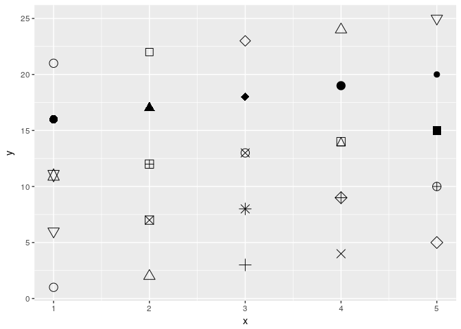

      s + geom_point(aes(shape = z), size = 4, colour = "Red") +
        scale_shape_identity()

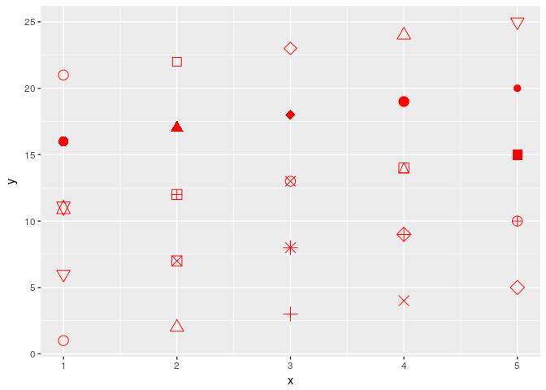

      s + geom_point(aes(shape = z), size = 4, colour = "Red", fill = "Black") +
        scale_shape_identity()

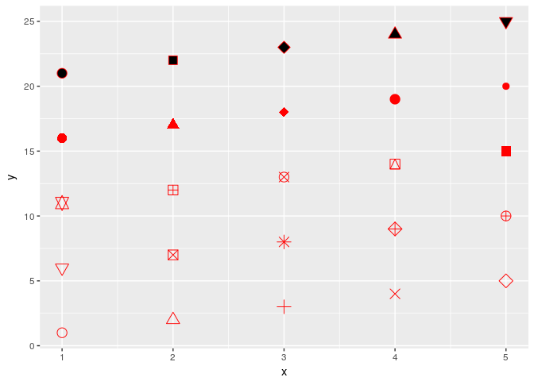

     pc2 +
        geom_point(shape = 1, size = 4)

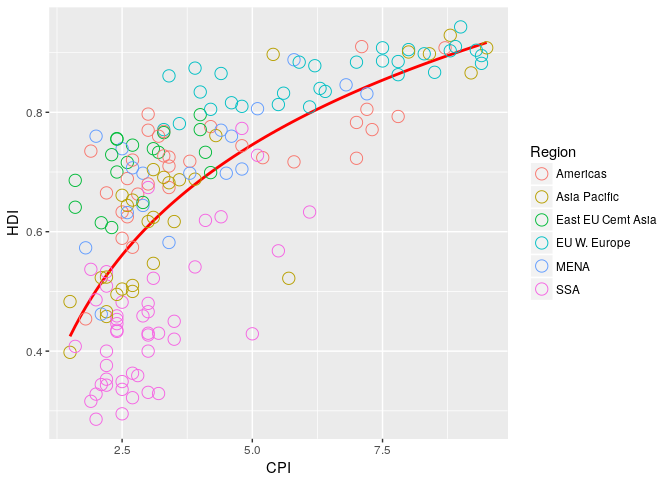

      (pc3 <- pc2 +
         geom_point(size = 4.5, shape = 1) +
         geom_point(size = 4, shape = 1) +
         geom_point(size = 3.5, shape = 1))

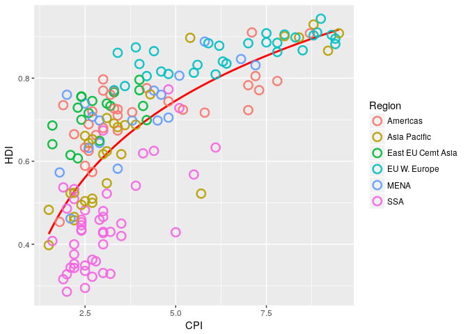

Labelling points:
=================

     pointsToLabel <- c("Russia", "Venezuela", "Iraq", "Myanmar", "Sudan",
                         "Afghanistan", "Congo", "Greece", "Argentina", "Brazil",
                         "India", "Italy", "China", "South Africa", "Spane",
                         "Botswana", "Cape Verde", "Bhutan", "Rwanda", "France",
                         "United States", "Germany", "Britain", "Barbados", "Norway", "Japan",
                         "New Zealand", "Singapore")

    (pc4 <- pc3 +
        geom_text(aes(label = Country),
                  color = "gray20",
                  data = subset(dat, Country %in% pointsToLabel)))

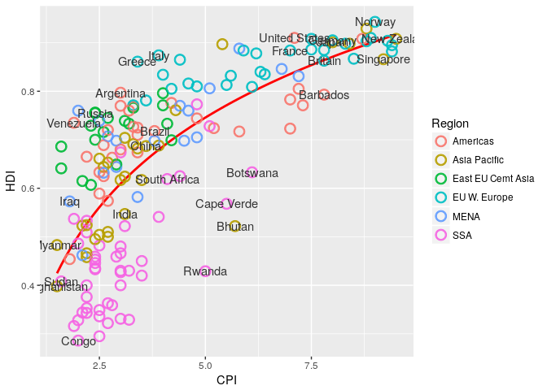

     library("ggrepel")
      pc3 +
        geom_text_repel(aes(label = Country),
                  color = "gray20",
                  data = subset(dat, Country %in% pointsToLabel),
                  force = 10)

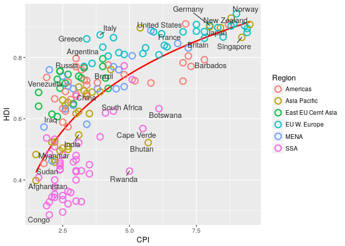

Change the region labels and order:
===================================

      dat$Region <- factor(dat$Region,
                           levels = c("EU W. Europe",
                                      "Americas",
                                      "Asia Pacific",
                                      "East EU Cemt Asia",
                                      "MENA",
                                      "SSA"),
                           labels = c("OECD",
                                      "Americas",
                                      "Asia &\nOceania",
                                      "Central &\nEastern Europe",
                                      "Middle East &\nnorth Africa",
                                      "Sub-Saharan\nAfrica"))

    pc4$data <- dat
      pc4

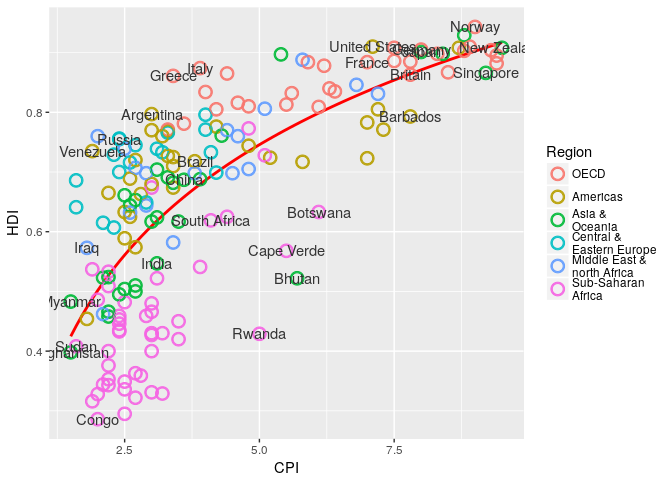

Add title and format axes:
==========================

      library(grid)
      (pc5 <- pc4 +
        scale_x_continuous(name = "Corruption Perceptions Index, 2011 (10=least corrupt)",
                           limits = c(.9, 10.5),
                           breaks = 1:10) +
        scale_y_continuous(name = "Human Development Index, 2011 (1=Best)",
                           limits = c(0.2, 1.0),
                           breaks = seq(0.2, 1.0, by = 0.1)) +
        scale_color_manual(name = "",
                           values = c("#24576D",
                                      "#099DD7",
                                      "#28AADC",
                                      "#248E84",
                                      "#F2583F",
                                      "#96503F")) +
        ggtitle("Corruption and Human development"))

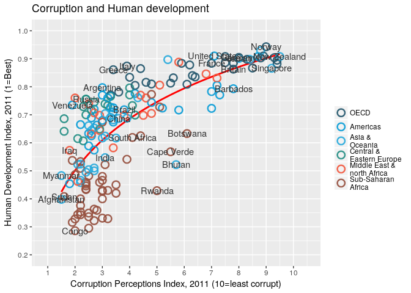

Theme tweaks:
=============

    library(grid) # for the 'unit' function
      (pc6 <- pc5 +
        theme_minimal() + # start with a minimal theme and add what we need
        theme(text = element_text(color = "gray20"),
              legend.position = c("top"), # position the legend in the upper left 
              legend.direction = "horizontal",
              legend.justification = 0.1, # anchor point for legend.position.
              legend.text = element_text(size = 11, color = "gray10"),
              axis.text = element_text(face = "italic"),
              axis.title.x = element_text(vjust = -1), # move title away from axis
              axis.title.y = element_text(vjust = 2), # move away for axis
              axis.ticks.y = element_blank(), # element_blank() is how we remove elements
              axis.line = element_line(color = "gray40", size = 0.5),
              axis.line.y = element_blank(),
              panel.grid.major = element_line(color = "gray50", size = 0.5),
              panel.grid.major.x = element_blank()
              ))

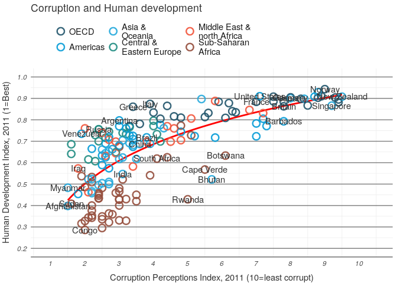

Add model R2 and source note:
=============================

    (mR2 <- summary(lm(HDI ~ log(CPI), data = dat))$r.squared)

    ## [1] 0.5212859

      library(grid)
     # png(file = "~/Desktop/eeb-177/lab-work/exercise-8/Rgraphics/images/econScatter10.png", width = 800, height = 600)
      pc6 
      grid.text("Sources: Transparency International; UN Human Development Report",
               x = .02, y = .03,
               just = "left",
               draw = TRUE)
      grid.segments(x0 = 0.81, x1 = 0.825,
                    y0 = 0.90, y1 = 0.90,
                    gp = gpar(col = "red"),
                    draw = TRUE)
      grid.text(paste0("R² =  0.5212859",
                       as.integer(mR2*100),
                       "%"),
                x = 0.835, y = 0.90,
                gp = gpar(col = "gray20"),
                draw = TRUE,
                just = "left")

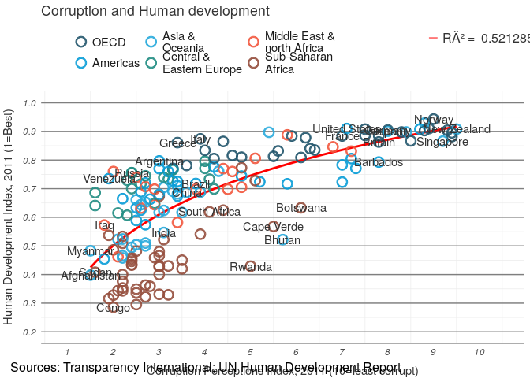

     # dev.off()
